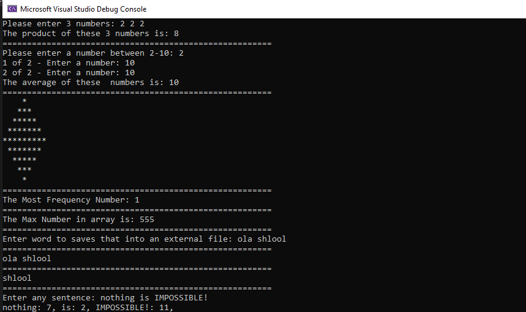
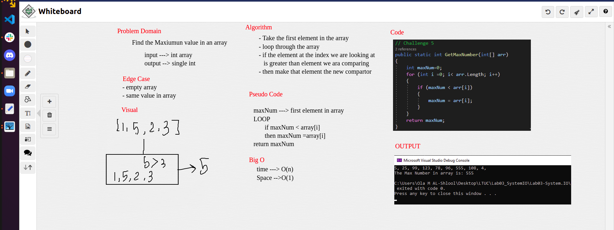

# Lab03_SystemIO
### Description
This is a C# console application that will demonstrates the use of System.IO and to help me practice my C# knowledge.
### How do you run the program?

1. Clone repo to your device.
2. Open the solution file Lab03-System.IO.sln in Visual Studio.
3. To run the app, go to Debug > Start Without Debugging (or press ctrl+F5).

## Output Visual Challenges 01-09

## Challenge 05 - Whiteboard

